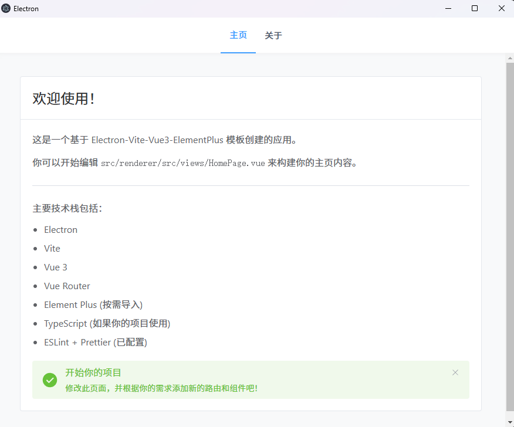

# Electron-Vite-Vue3-ElementPlus 模板

这是一个精心配置的 Electron 应用模板，集成了 Vue 3, Vite, Element Plus (按需导入), TypeScript, Vue Router, ESLint 和 Prettier，旨在帮助你快速启动跨平台桌面应用的开发。



## ✨ 特性

* **最新的技术栈:**
    * Electron：使用 JavaScript, HTML 和 CSS 构建跨平台桌面应用程序。
    * Vite：下一代前端构建工具，提供极速的冷启动和热更新。
    * Vue 3：现代化的渐进式 JavaScript 框架，使用 Composition API。
    * Vue Router：Vue.js 官方的路由管理器。
    * Element Plus：一个流行的基于 Vue 3 的 UI 组件库，已配置按需自动导入。
    * TypeScript：为 JavaScript 添加了静态类型检查，增强代码健壮性。
* **开箱即用的开发环境:**
    * 基础项目结构已搭建完毕。
    * 集成了 ESLint 和 Prettier，自动进行代码检查和格式化，确保代码质量和风格统一。
    * VS Code 推荐插件已在下方列出，配合使用体验更佳。
* **优化配置:**
    * Element Plus 组件和 API 按需自动导入，有效减小打包体积。
    * 提供了简洁的欢迎页面和基础路由配置作为起点。
* **易于定制:** 清理了不必要的示例代码，方便你快速开始自己的业务逻辑开发。

## 🛠️ 推荐的 IDE 设置

* [VSCode](https://code.visualstudio.com/)
* [Volar](https://marketplace.visualstudio.com/items?itemName=Vue.volar) (Vue 3 语言支持，请确保禁用或卸载 Vetur)
* [ESLint](https://marketplace.visualstudio.com/items?itemName=dbaeumer.vscode-eslint)
* [Prettier - Code formatter](https://marketplace.visualstudio.com/items?itemName=esbenp.prettier-vscode)
* [TypeScript Vue Plugin (Volar)](https://marketplace.visualstudio.com/items?itemName=Vue.vscode-typescript-vue-plugin) (提供 `.vue` 文件中 TypeScript 的完整支持，通常随 Volar 一起工作)

## 🚀 如何使用此模板

### 1. 基于此模板创建你的新项目

**推荐方式：通过 GitHub 模板功能**

1.  访问此模板仓库的 GitHub 页面: [https://github.com/NewbieAuntieCodes/electron-vite-vue3-elementplus-template](https://github.com/NewbieAuntieCodes/electron-vite-vue3-elementplus-template)
2.  点击页面右上角的 "Use this template" (使用此模板) 按钮，然后选择 "Create a new repository" (创建新仓库)。
3.  为你的新仓库命名，选择可见性，然后点击 "Create repository from template" (从模板创建仓库)。
4.  将你新创建的仓库克隆到本地：
    ```bash
    git clone [https://github.com/你的用户名/你的新仓库名.git](https://github.com/你的用户名/你的新仓库名.git)
    cd 你的新仓库名
    ```

**备选方式：直接克隆此模板仓库**

```bash
git clone [https://github.com/NewbieAuntieCodes/electron-vite-vue3-elementplus-template.git](https://github.com/NewbieAuntieCodes/electron-vite-vue3-elementplus-template.git) 你的新项目名称
cd 你的新项目名称
# (可选) 如果你想清除模板的 Git 历史，并为你的项目开始一个全新的历史记录：
# rm -rf .git
# git init
# git add .
# git commit -m "Initial commit from template"
```

### 2\. 安装依赖

本项目推荐使用 `pnpm` 进行包管理，当然你也完全可以使用 `npm` 或 `yarn`。

```bash
pnpm install
```

或者:

```bash
npm install
```

或者:

```bash
yarn install
```

### 3\. 修改项目配置以匹配你的应用

**非常重要！** 请务必修改以下配置文件中的信息：

- **`package.json`:**
  - `name`: 你的应用名称 (例如: `my-cool-desktop-app`)
  - `version`: 通常从 `0.1.0` 或 `1.0.0` 开始
  - `description`: 你的应用描述
  - `author`: 你的名字或组织名称
  - `repository`: (可选) 更新为你新项目的 Git 仓库地址
- **Electron Builder 配置 (通常在 `package.json` 的 `build` 字段，或者独立的 `electron-builder.yml` 文件中):**
  - `appId`: 你的应用的唯一标识符 (例如: `com.yourcompany.yourappname`)。这非常重要，尤其是在 macOS 和 Windows 上用于代码签名和更新。
  - `productName`: 你的应用在操作系统中显示的名称 (例如: "我的酷应用")。
  - `copyright`: (可选) 你的版权信息。
  - (可选) 配置应用图标路径等。

### 4\. 开发

启动开发服务器和 Electron 应用：

```bash
pnpm dev
```

### 5\. 构建应用

构建适用于不同平台的应用程序安装包：

```bash
# 构建 Windows 应用
pnpm build:win

# 构建 macOS 应用
pnpm build:mac

# 构建 Linux 应用
pnpm build:linux
```

(请确保这些脚本与你 `package.json` 中 `scripts` 字段定义的命令一致。)

## 📁 项目结构 (概览)

```
.
├── release/                    # (构建后生成) 打包好的应用安装包
├── out/                        # (构建后生成) 未打包的 Electron 应用文件
├── dist/                       # (构建后生成) Vite 打包的前端资源
├── docs/
│   └── images/
│       └── YOUR_SCREENSHOT_NAME.png # README 中的应用截图 (请替换为你实际的文件名)
├── src/
│   ├── main/                   # Electron 主进程代码 (Node.js 环境)
│   │   └── index.ts
│   ├── preload/                # Electron 预加载脚本 (隔离的 Node.js 环境)
│   │   └── index.ts
│   └── renderer/               # Vue 渲染进程代码 (浏览器环境)
│       ├── src/
│       │   ├── assets/         # 静态资源 (图片, 全局CSS等)
│       │   ├── components/     # (模板中初始为空) 用户可在此创建通用Vue组件
│       │   ├── router/         # Vue Router 配置
│       │   │   └── index.ts
│       │   ├── views/          # 路由对应的页面组件 (如 HomePage.vue)
│       │   ├── App.vue         # Vue 应用根组件
│       │   └── main.ts         # Vue 应用入口文件
│       └── index.html          # 渲染进程的 HTML 入口
├── .gitignore                  # Git 忽略文件配置
├── .prettierrc.json            # Prettier 格式化配置文件 (模板已包含推荐配置)
├── electron-vite.config.ts     # Electron-Vite 配置文件
├── eslint.config.mjs           # ESLint 配置文件 (Flat Config)
├── LICENSE                     # 项目许可证文件 (例如 MIT)
├── package.json                # 项目元数据、依赖和脚本
├── README.md                   # 项目说明文档
├── tsconfig.json               # TypeScript 根配置文件
├── tsconfig.node.json          # TypeScript 主进程和预加载脚本配置
└── tsconfig.web.json           # TypeScript 渲染进程配置
```

## 💡 注意事项

- 开发前，请务必根据你的实际需求修改 `package.json` 中的 `name`，以及 Electron Builder 配置中的 `appId`, `productName` 等信息。
- 模板提供了一个良好实践的基础 ESLint 和 Prettier 配置，你可以根据团队规范进行微调。
- 别忘了替换 README 中的占位截图 `YOUR_SCREENSHOT_HERE.png` 为你应用的实际截图。

## 🤝 贡献 (可选)

如果你发现此模板有任何可以改进的地方，或者有好的建议，欢迎提交 Pull Request 或创建 Issue！

## 📄 许可证 (可选)

此模板项目使用 [MIT](https://www.google.com/search?q=LICENSE) 许可证。
